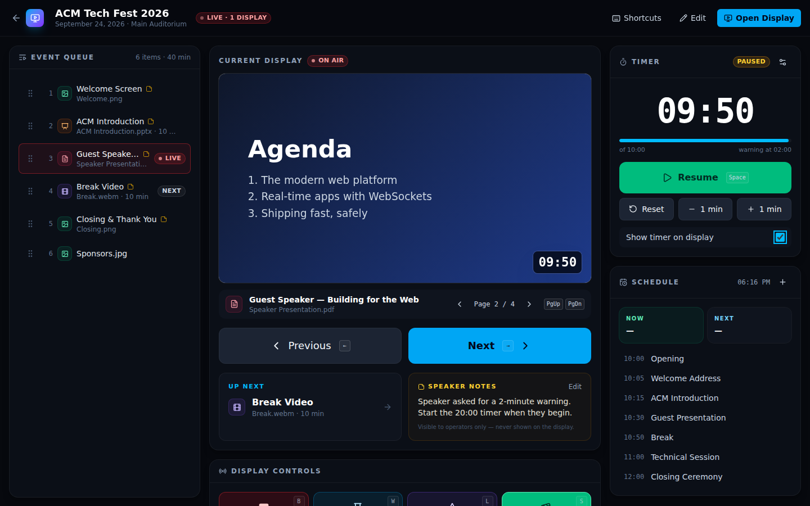
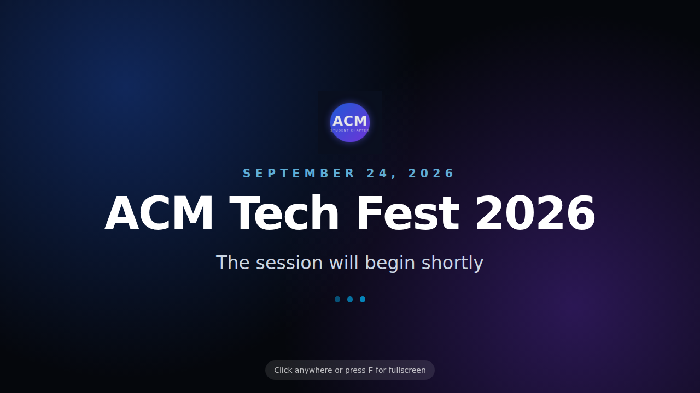
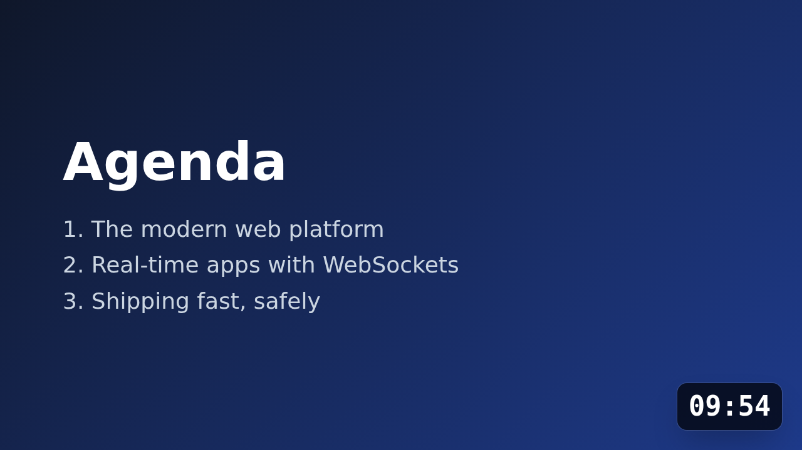
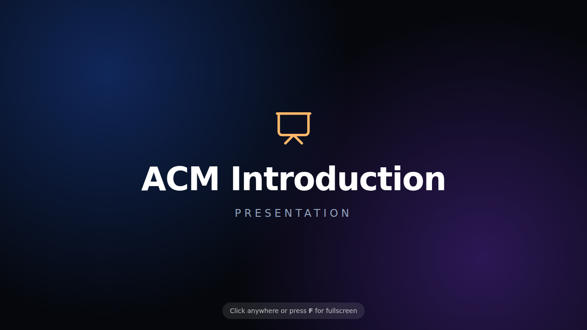

# EventControl

**Event presentation and projector control system.** One dashboard for the person running the projector at a college fest, conference or seminar, plus a clean audience display that shows only what the operator chooses.

```
 OPERATOR DASHBOARD  ──►  SERVER (Express + Socket.IO + SQLite)  ──►  PROJECTOR DISPLAY
   /events/:id              authoritative display + timer state          /display/:id
```



---

## 1. What is EventControl?

EventControl is a local web application that turns any laptop into a lightweight **event AV control room**. The operator:

- creates an event and uploads its slides, PDFs, images and videos,
- arranges them into an ordered **event queue**,
- presses **NEXT / PREVIOUS** to step through the queue,
- sees the **current** and **up next** items and **speaker notes**,
- runs a **countdown timer** that stays in sync on every screen,
- can hit **BLACK SCREEN**, **WAITING SCREEN** or **SHOW LOGO** at any moment.

A second browser window, `/display/:eventId`, is dragged to the projector and made fullscreen. It has no controls or navigation, and it updates as soon as the operator acts.

## 2. What problem it solves

At real events the person at the projector juggles PowerPoint, a PDF viewer, a video player, a file explorer full of `final_v3 (2).pptx` files, a phone timer and a printed schedule. Every switch between applications risks showing the audience the desktop, a notification or the wrong file.

EventControl puts all of that in **one screen**, and the audience only ever sees the display window.

## 3. Features

| Area | What you get |
| --- | --- |
| **Events** | Create, edit, delete and open events (name, date, venue, description, custom waiting-screen message, logo). |
| **Media library** | Drag-and-drop upload of `.ppt .pptx .pdf .png .jpg .jpeg .webp .mp4 .webm .mov`. Type detection, icons, thumbnails, rename, delete, open, download, add to queue, "show now". Duplicate files are detected by SHA-256 and skipped. |
| **Event queue** | Ordered playlist of media with drag-and-drop reordering (mouse or keyboard), optional title, planned duration and notes. Stored in SQLite. |
| **Current / Next** | The dashboard always shows what is on air, what comes next and the current item's speaker notes. |
| **Projector display** | Fullscreen audience view: images, video (with play/pause/restart from the dashboard), PDFs rendered page by page (page control from the dashboard), a title card for PowerPoint files, a waiting screen, a logo screen and a black screen. |
| **Program monitor** | The dashboard shows a live, scaled copy of exactly what the projector shows. It uses the same rendering component as the display. |
| **Emergency controls** | Large, colour-coded BLACK / WAITING / LOGO / SHOW CURRENT buttons with single-key shortcuts. Black screen takes about 30–80 ms end to end in local testing. |
| **Timer** | Server-authoritative countdown with a configurable duration and warning threshold, start/pause/reset, ±1 minute, and an optional overlay on the projector. |
| **Schedule** | A simple time-based run sheet with NOW / NEXT / upcoming based on the wall clock. It is a reference for the operator and does not advance anything on its own. |
| **Speaker notes** | Per queue item and visible to operators only. The server never sends them to display clients, and a test checks this. |
| **Presence** | LIVE / OFFLINE badge showing how many displays are connected, plus alerts when a display drops or the server connection is lost. |
| **Resilience** | Displays reconnect automatically and restore the exact state (including the PDF page and the timer). State is persisted, so it also survives a server restart. |
| **Keyboard first** | Every live action has a shortcut. Press `?` in the dashboard to see them. |
| **Demo mode** | The first start seeds "ACM Tech Fest 2026" with real sample media, a queue with notes and a schedule. |

### Keyboard shortcuts (dashboard)

| Key | Action |
| --- | --- |
| `→` / `←` | Next / previous queue item |
| `Space` | Start / pause timer |
| `B` | Black screen |
| `W` | Waiting screen |
| `L` | Show event logo |
| `S` | Show current item (go back on air) |
| `F` | Ask the display to go fullscreen |
| `PgDn` / `PgUp` | Next / previous PDF page |
| `R` | Reset timer |
| `?` | Shortcut help |
| `Esc` | Close dialogs / exit fullscreen |

Shortcuts are ignored while typing in a text field, and holding a key down never skips several items.

On the display window, a click or `F` toggles fullscreen.

## 4. Architecture

```
event-control/
├── client/                 React + Vite + TypeScript + Tailwind (operator UI and display)
│   └── src/
│       ├── pages/          EventsPage, DashboardPage, DisplayPage
│       ├── components/     ui/ (primitives), dashboard/ (panels), display/ (DisplayStage, PdfView)
│       ├── hooks/          useEventSocket, useTimerRemaining, useKeyboardShortcuts, useEventData
│       ├── services/       REST client (api.ts), Socket.IO client (socket.ts)
│       ├── lib/            formatting, schedule and timer maths
│       └── types/          shared DTO types
├── server/                 Express + Socket.IO + Prisma (TypeScript)
│   ├── src/
│   │   ├── routes/         REST route table
│   │   ├── controllers/    events, media, queue, schedule, control
│   │   ├── services/       displayService, timerService, controlService, mediaStorage, demoSeed
│   │   ├── socket/         Socket.IO server, room layout (bus.ts)
│   │   ├── middleware/     error handling
│   │   ├── app.ts          Express app factory (also serves client/dist in production)
│   │   └── server.ts       entry point
│   ├── demo-assets/        media used by demo mode
│   └── test/               Vitest + Supertest + Socket.IO integration tests
├── prisma/schema.prisma    SQLite schema (DB file: prisma/eventcontrol.db)
├── uploads/                uploaded media: <eventId>/{presentations,videos,images,documents}/
└── package.json            npm workspaces + top-level scripts
```

### Data model

```
Event ─┬─< Media ─────< QueueItem   (QueueItem → Media, cascade on delete)
       ├─< QueueItem
       ├─< ScheduleItem
       ├── TimerState    (1:1, persisted authoritative timer)
       └── DisplayState  (1:1, persisted "what is on screen")
```

All child rows cascade when an event is deleted, and the event's upload folder is removed as well.

### Server-side state

The server is the **single source of truth** for each event's display and timer:

- `displayService` holds `{ mode, queueItemId (cursor), adHocMediaId, page }` in memory, builds a **display snapshot** (event name, waiting message, media URL, title, logo), broadcasts it and persists it to SQLite.
- `timerService` holds `{ status, durationMs, warningMs, remainingMs, startedAt }`. Clients never count down on their own. They compute `remaining = remainingMs − (serverNow − startedAt)` using a measured clock offset, so every screen shows the same value. The server schedules a timeout that marks the timer `finished`.
- `controlService` is one typed command dispatcher (validated with Zod) used by both Socket.IO and REST.

## 5. Technology stack

| Layer | Choice |
| --- | --- |
| Frontend | React 19, Vite, TypeScript, Tailwind CSS v4, React Router, lucide-react icons, dnd-kit (drag and drop), pdf.js |
| Backend | Node.js (≥ 20), Express 5, TypeScript, Multer (uploads), Zod (validation) |
| Real time | Socket.IO 4 |
| Database | SQLite through Prisma ORM 6 |
| Tests | Vitest, Supertest, socket.io-client |

## 6. Installation

Requirements: **Node.js 20 or newer** and npm.

```bash
git clone <this repo> event-control
cd event-control
npm install        # installs client + server (npm workspaces) and generates the Prisma client
```

## 7. Running the frontend and backend

### Development (hot reload)

```bash
npm run dev
```

This creates or updates the SQLite database (`prisma db push`), then starts:

- **Backend** on http://localhost:4000 (API + Socket.IO)
- **Frontend** on **http://localhost:5173** ← open this

Vite proxies `/api` and `/socket.io` to the backend, so the browser only talks to port 5173.

The first start seeds the demo event. To start again from scratch, stop the app and run `npm run db:reset`. Then delete the old event folders in `uploads/` (keep `.gitkeep`).

### Production (single port)

```bash
npm run build      # compiles server to server/dist and client to client/dist
npm start          # serves API, Socket.IO and the built UI on http://localhost:4000
```

### Other scripts

| Command | Purpose |
| --- | --- |
| `npm test` | Server integration tests (temporary database, never touches your data) |
| `npm run e2e` | Browser end-to-end check of the critical flow against the running app (needs `npx playwright install chromium` once, or `CHROME_PATH=/path/to/chrome`) |
| `npm run typecheck` | TypeScript checks for server and client |
| `npm run db:push` | Apply `prisma/schema.prisma` to the SQLite database |
| `npm run db:reset` | Wipe the database (re-seeds the demo on next start) |

### Configuration (environment variables, all optional)

| Variable | Default | Meaning |
| --- | --- | --- |
| `PORT` | `4000` | Backend port |
| `HOST` | `0.0.0.0` | Bind address (all interfaces, so a projector laptop on the LAN can connect) |
| `UPLOADS_DIR` | `./uploads` | Where media files are stored |
| `MAX_UPLOAD_MB` | `1024` | Per-file upload limit |
| `ALLOW_EXTERNAL_OPEN` | `true` | Allow "Open in PowerPoint" to launch files on the server machine |
| `SEED_DEMO` | `true` | Create the demo event when the database is empty |
| `DATABASE_URL` | `prisma/eventcontrol.db` | Override the SQLite file used at runtime (e.g. `file:/data/ec.db`) |
| `API_TARGET` | `http://localhost:4000` | (client dev server) where Vite proxies API calls |

## 8. Creating an event

1. Open http://localhost:5173 and click **Create Event**.
2. Enter a name, date and optional venue, description and waiting-screen message. You land on the event dashboard.
3. **Upload media**: drop files onto the *Media library* panel or click **Upload**. Unsupported or disguised files (e.g. a `.txt` renamed to `.png`) are rejected with a clear message, and duplicates are skipped.
4. Click **+ Queue** on each file to add it to the *Event queue*. Drag the ☰ handle to reorder, and use ✎ to add a title such as "Director Speech", a planned duration and **speaker notes**.
5. Optional: choose an image as the **event logo** (media ⋯ menu → *Use as event logo*, or **Edit** in the header).
6. Optional: add the run sheet in the *Schedule* panel (＋), and set the timer duration and warning threshold (⚙ in the *Timer* panel).

## 9. Connecting the projector / display

**Same laptop (most common):**

1. Connect the projector and set the OS to **extend** (not mirror) the desktop.
2. In the dashboard click **Open Display**. A new window opens at `/display/<eventId>`.
3. Drag that window onto the projector screen and **click it once** (or press `F`) to go fullscreen. That click also lets the browser play video with sound.
4. The dashboard header now shows **LIVE · 1 display**.

**Separate projector machine (e.g. a PC in the AV booth):**

1. Start EventControl on the operator laptop. The server log prints `on your network: http://192.168.x.y:4000`.
2. On the projector machine open `http://192.168.x.y:5173/display/<eventId>` in dev mode, or `:4000` in production mode. You can copy the event id from the dashboard URL.
3. Click once for fullscreen.

The **FULLSCREEN DISPLAY** button (`F`) asks the display to go fullscreen remotely. Browsers only allow this after someone has clicked the display window at least once, and the dashboard tells you if it was blocked.

If the display's network drops, it **keeps showing the last content**, reconnects automatically and re-syncs. If you refresh or reopen it, it restores exactly what it should be showing, including the PDF page and the timer.

### How each media type is shown

| Type | On the display |
| --- | --- |
| Image | Fullscreen, letterboxed on black |
| Video | Fullscreen playback; Play / Pause / Restart from the dashboard. It autoplays with sound once the display has been clicked, and muted otherwise. |
| PDF | Rendered with pdf.js one page at a time, fitted to the screen; page control from the dashboard (`PgUp`/`PgDn`) |
| PowerPoint | A title card with the item title. Use **Open in PowerPoint** to launch the file in PowerPoint on the machine running the server, then present from PowerPoint. EventControl does not try to re-implement PowerPoint. |
| Waiting | Event name, date, waiting message and logo |
| Logo | The event logo (or a typographic event name if no logo is set) |
| Black | Pure black. The timer overlay is hidden as well. |

## 10. How Socket.IO works here

Each client connects and joins its event with a role:

```ts
socket.emit('event:join', { eventId, role: 'operator' | 'display' }, ack)
// ack → { ok: true, data: { display: DisplaySnapshot, timer: TimerSnapshot, presence } }
```

The server puts the socket into rooms:

| Room | Members | Receives |
| --- | --- | --- |
| `event:<id>` | everyone | `display:update`, `timer:update`, `event:changed`, `event:deleted` |
| `event:<id>:operators` | dashboards | `queue:changed`, `media:changed`, `schedule:changed`, `presence:update`, `display:fullscreen-result` |
| `event:<id>:displays` | projector windows | `display:video`, `display:fullscreen` |

**Operator commands** all go through one acknowledged event, which only operator sockets may send:

```ts
socket.emit('control', { type: 'next' }, ack)                 // NEXT
socket.emit('control', { type: 'previous' }, ack)             // PREVIOUS
socket.emit('control', { type: 'show-item', queueItemId }, ack)
socket.emit('control', { type: 'show-media', mediaId }, ack)  // SHOW_MEDIA (straight from the library)
socket.emit('control', { type: 'show-current' }, ack)
socket.emit('control', { type: 'black' | 'waiting' | 'logo' }, ack)
socket.emit('control', { type: 'page', delta: 1 }, ack)       // PDF page
socket.emit('control', { type: 'video', action: 'play' | 'pause' | 'restart' }, ack)
socket.emit('control', { type: 'fullscreen' }, ack)
socket.emit('control', { type: 'timer-start' | 'timer-pause' | 'timer-toggle' | 'timer-reset' }, ack)
socket.emit('control', { type: 'timer-adjust', deltaMs: 60000 }, ack)
socket.emit('control', { type: 'timer-configure', durationMs, warningMs, showOnDisplay }, ack)
```

**Design decisions**

- **Full snapshots, not deltas.** Every change broadcasts the complete `display:update` snapshot, so a client can never drift out of sync. Snapshots carry a monotonic `version`, and clients drop anything older than what they have.
- **The ack carries the new state.** The operator UI updates as soon as the server confirms, and the broadcast confirms it again.
- **Emergency fast path.** Black, waiting and logo reuse the cached snapshot and skip the database entirely. Persistence happens after the broadcast.
- **Reconnect.** The Socket.IO client retries forever (0.5–3 s backoff). On every `connect` the client re-emits `event:join` and receives a fresh snapshot. Short drops also benefit from Socket.IO connection-state recovery.
- **Clock sync.** `clock:ping` measures the offset between client and server clocks (re-measured every minute), so countdowns match across machines.
- **Notes stay private.** Speaker notes are only in REST queue responses and operator-room events. Display snapshots never include them, and the test suite asserts this.
- **Same commands over REST.** `POST /api/events/:id/control` accepts the same JSON (e.g. `{"type":"black"}`), so a future phone remote or Stream Deck can reuse it.

### REST API

| Method | Path | Description |
| --- | --- | --- |
| GET | `/api/events` | List events (with media/queue counts) |
| POST | `/api/events` | Create event `{ name, date: "YYYY-MM-DD", description?, venue?, waitingMessage? }` |
| GET | `/api/events/:id` | Get event |
| PUT | `/api/events/:id` | Update event (incl. `logoMediaId`) |
| DELETE | `/api/events/:id` | Delete event, its media files, queue and schedule |
| GET | `/api/events/:id/media` | List media |
| POST | `/api/events/:id/media` | Upload (`multipart/form-data`, field `files`, up to 20 per request) → `{ uploaded, duplicates, rejected }` |
| PATCH | `/api/media/:id` | Rename `{ name }` |
| DELETE | `/api/media/:id` | Delete media (and its queue entries) |
| GET | `/api/media/:id/file` | Stream the file (HTTP range support; `?download=1` for attachment) |
| POST | `/api/media/:id/open` | Open the file with its native app on the server machine |
| GET | `/api/events/:id/queue` | Get queue |
| POST | `/api/events/:id/queue` | Append `{ mediaId, title?, notes?, durationSeconds? }` |
| PUT | `/api/events/:id/queue` | Reorder `{ order: [queueItemId, …] }` (must list every item once) |
| PATCH | `/api/queue/:id` | Update `{ title?, notes?, durationSeconds? }` |
| DELETE | `/api/queue/:id` | Remove from queue |
| GET | `/api/events/:id/schedule` | Get schedule |
| POST | `/api/events/:id/schedule` | Add `{ time: "HH:MM", title, description?, durationMinutes? }` |
| PATCH / DELETE | `/api/schedule/:id` | Update / delete schedule item |
| GET | `/api/events/:id/state` | Current display + timer + presence |
| POST | `/api/events/:id/control` | Run a control command (same payload as the socket) |
| GET | `/api/health` | Health check |

Errors always look like `{ "error": "Human readable message." }` with an appropriate status code (400 validation, 403 forbidden, 404 not found, 413 file too large, 500 unexpected). Stack traces are only logged on the server.

### Security and reliability

- **Upload allowlist.** The extension decides the type, and the file's **magic bytes must match**, so a `.exe` renamed to `.png` is rejected.
- **Filenames are sanitized** (ASCII, no path separators), prefixed with a random id and stored under `uploads/<eventId>/<type>/`. Multer writes to a random temp name first, so client-supplied names never reach the filesystem unsanitized.
- **Path traversal protection.** Every stored path is resolved and checked to be inside `uploads/`. Clients only ever see `/api/media/:id/file` URLs, never filesystem paths.
- **Size limits**: `MAX_UPLOAD_MB` per file, 20 files per request, 1 MB JSON bodies.
- **Input validation** on every route and socket command with Zod. Ids are validated before touching the filesystem.
- **No arbitrary command execution.** "Open in PowerPoint" launches only files tracked in the database, with a fixed OS opener (`open` / `explorer.exe` / `xdg-open`) and **no shell**. It can be disabled with `ALLOW_EXTERNAL_OPEN=false`.
- **Missing files** are reported (`Media file no longer exists.`) and flagged in the library. The audience display falls back to the waiting screen instead of showing an error.
- No authentication in the MVP, by design. It is intended for a trusted local network.

### Technical decisions (made where the brief left room)

| Decision | Why |
| --- | --- |
| npm workspaces (`client`, `server`) with Prisma at the root | One `npm install` and one `npm run dev`; front and back end stay cleanly separated. |
| SQLite file at `prisma/eventcontrol.db` (hard-coded default, `DATABASE_URL` override) | Nothing to configure for a local app, and no `.env` file needed. |
| `prisma db push` instead of migrations | A simpler MVP workflow. Switch to `prisma migrate` once the schema stabilizes. |
| Display state persisted in a `DisplayState` table | "What is on screen" survives server restarts, not just display refreshes. |
| Queue cursor plus ad-hoc media | "Show now" from the library doesn't lose your place in the queue. NEXT continues from the cursor. |
| Removing the on-air item switches the display to the waiting screen | The audience never jumps to unexpected content. |
| pdf.js (legacy build) instead of the browser's PDF viewer | No toolbar on the projector, remote page control, and it works on older browsers. |
| Video plays once and holds the last frame | This is predictable. The operator can restart it from the dashboard. |
| Server also serves the built client in production | A single port, which makes a later Electron wrapper trivial: start the server, then load `http://localhost:4000`. |
| Schedule "now/next" follows the local wall clock | This matches how operators use a printed run sheet. |
| Demo "Break" video is WebM | It is generated without ffmpeg. MP4 and MOV uploads are fully supported. |

## 11. Future improvements

These are intentionally **not** in the MVP:

- PowerPoint slide-level control
- Google Slides integration
- Remote phone controller (the REST control endpoint is ready for it)
- Multi-projector support / multiple display outputs
- OBS integration
- Audio control
- Automatic event playback (auto-advance by duration or schedule)
- Cloud synchronization
- User authentication and team collaboration
- Event templates
- Analytics / logging
- Electron desktop application
- Raspberry Pi display node

## 12. Screenshots

| | |
| --- | --- |
| **Events**  | **Operator dashboard**  |
| **Display: waiting screen**  | **Display: PDF with timer overlay**  |
| **Display: PowerPoint title card**  | |

---

## Verified MVP flow

The following flow is exercised end to end in a real browser by `npm run e2e` (Playwright/Chromium against the running app), and the server parts are also covered by `npm test`:

1. Start the application → 2. open the demo event → 3. upload an image (plus a rejected `.txt`, a disguised `.png` and a duplicate) → 4. add it to the queue → 5. open `/display/:eventId` in another window (dashboard shows LIVE) → 6. select an item, and the display shows it → 7–9. press **→**: presentation card, then PDF (and `PgDn` → page 2) → 10–11. press **B**: display goes black (~30–80 ms) → 12–13. **Space** starts the timer and it counts down correctly; operator and display show the same value → 14. refresh the display: it reconnects and restores the waiting screen, the PDF page and the timer overlay.

## Troubleshooting

| Symptom | Fix |
| --- | --- |
| `EADDRINUSE :4000` | Another instance is running, or start with `PORT=4100 npm run dev` and set `API_TARGET=http://localhost:4100` for the client. |
| Video plays muted on the display | Click the display window once (browser autoplay policy). |
| "The display blocked fullscreen" | Click the display window once, or press `F` there. |
| "Unable to start presentation" | No PowerPoint (or default app) on the server machine, or `ALLOW_EXTERNAL_OPEN=false`. The dashboard downloads the file instead. |
| Display can't be reached from another computer | Allow ports 5173/4000 through the OS firewall and use the LAN address printed by the server. |
