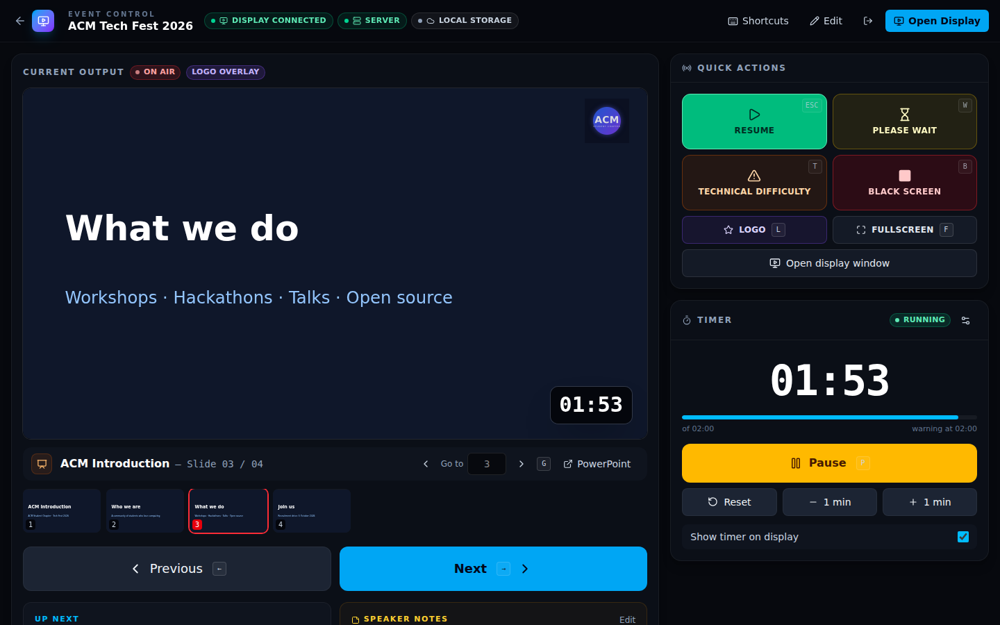
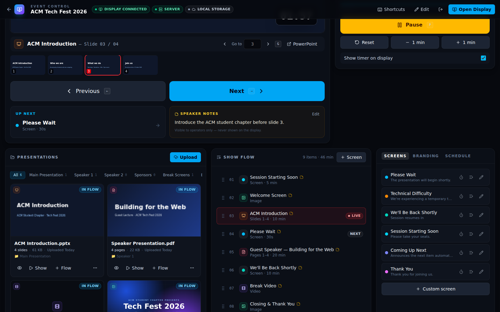
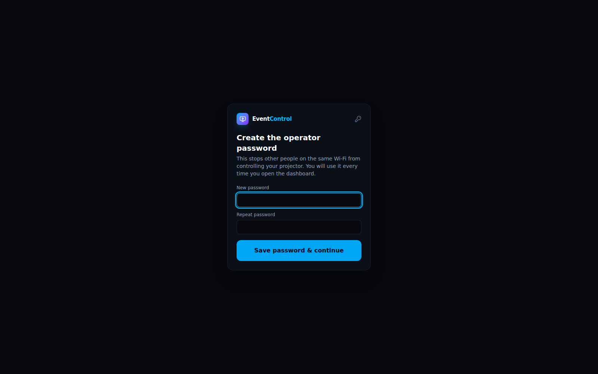
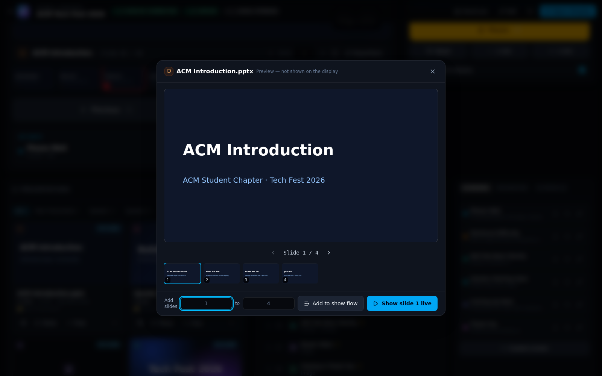
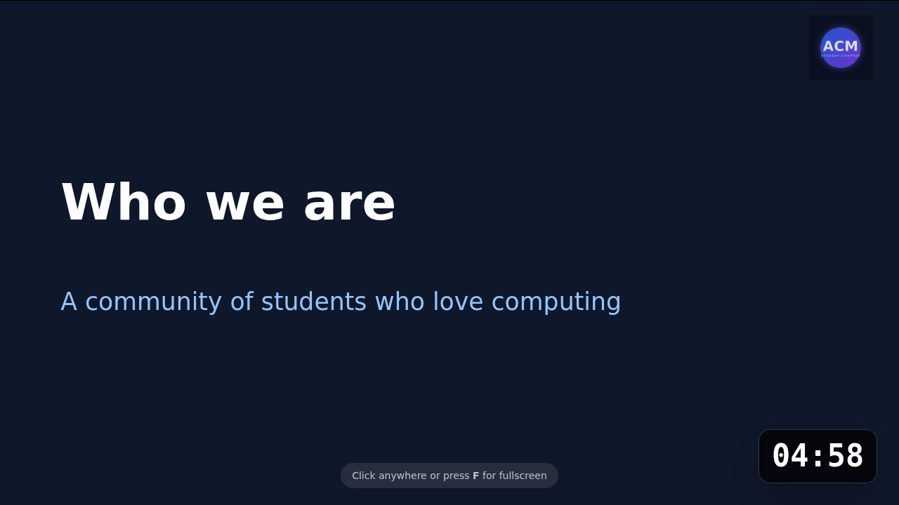
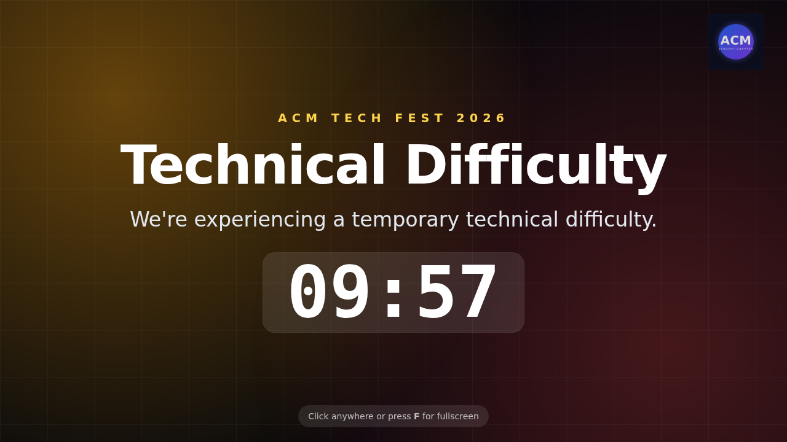
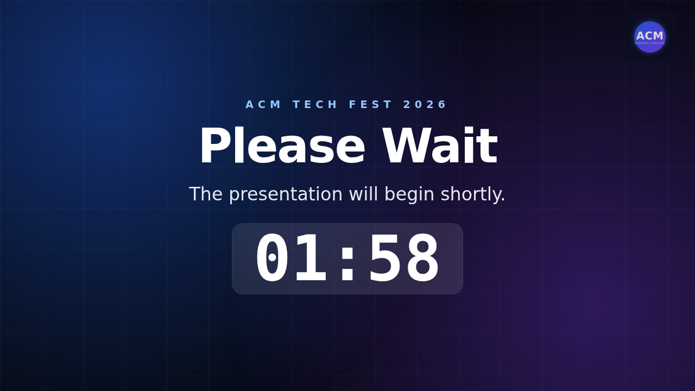
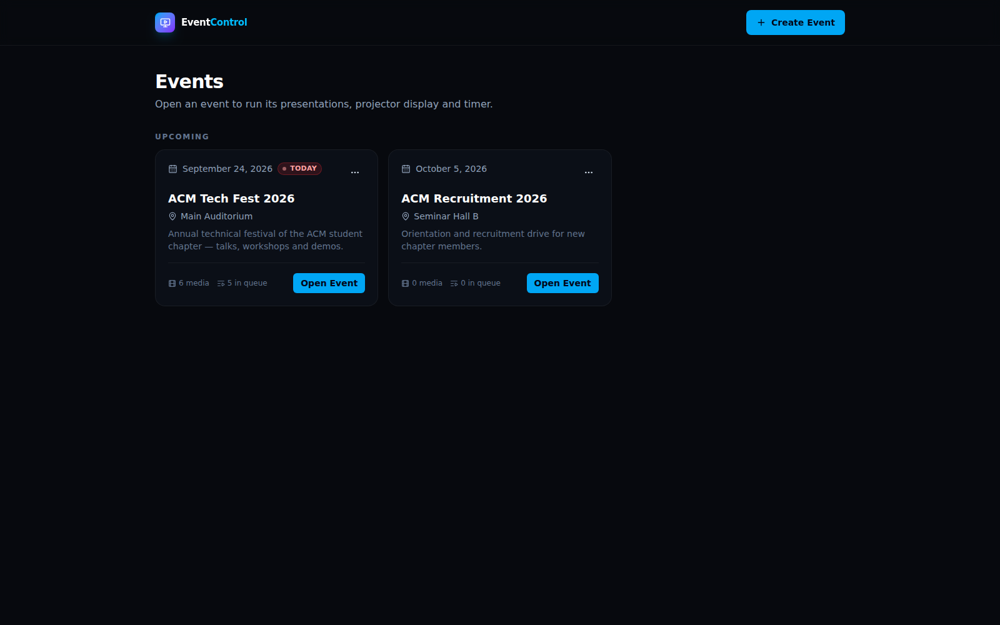

# EventControl — Mission Control for Presentations

A presentation control console for events, seminars, conferences and classrooms. One operator dashboard controls everything the projector shows: slides from **several independent PowerPoint/PDF files**, special screens (Please Wait, Technical Difficulty, Break, Thank You, custom announcements), logos, countdowns, images and videos. You don't need to open PowerPoint, Alt-Tab between windows or hunt for files.

```
UPLOAD → ORGANIZE → PREVIEW → QUEUE (Show Flow) → CONTROL → DISPLAY
```



---

## ⚡ Quick start (no commands needed)

1. Install **Node.js LTS** from https://nodejs.org (one time), then restart your computer.
2. *Recommended:* install **LibreOffice** from https://www.libreoffice.org (free). It turns PowerPoint files into slides EventControl can control one by one. PDFs, images and videos work without it.
3. On GitHub click the green **`<> Code`** button → **Download ZIP**, then right-click the ZIP → **Extract All…**
4. Open the extracted folder and double-click:
   - **Windows:** `START-EventControl.bat`. If Windows shows "Windows protected your PC", click **More info → Run anyway**. If nothing happens, open the folder, type `cmd` in the address bar, and run `npm install` then `npm run dev`.
   - **macOS:** `START-EventControl-mac.command`. The first time, right-click it → **Open** → **Open**.
5. The first run installs packages (1–3 minutes). Then your browser opens **http://localhost:5173**.
6. **Create the operator password** when asked. This stops other people on the same Wi-Fi from controlling your projector.

Keep the black window open while you use EventControl, and close it to stop the app. Forgot the password? Stop the app and run `npm run reset-password`.

---

## What the operator can do

| Area | Features |
| --- | --- |
| **Presentations library** | Upload PPT, PPTX, PDF, images (PNG/JPG/WEBP) and videos (MP4/WEBM/MOV) by drag-and-drop. Each file is a card with a thumbnail, slide/page count, upload date and status. Files are organised in **folders** (Main Presentation, Speaker 1, Speaker 2, Sponsors, Break Screens, Emergency Screens, Logos, Event Branding, or your own). You can **preview** a file privately, **show** it (optionally a specific slide), add it to the flow, rename, move, download or delete it. Duplicate uploads are detected and skipped. |
| **PowerPoint handling** | PPT/PPTX files are converted to PDF in the background with LibreOffice. The **original file is kept** and the converted version is what the display renders, which gives real slide-by-slide control. "Open in PowerPoint" launches the original if you need animations or embedded media. |
| **Show Flow (Run of Show)** | Prepare the whole event beforehand: `01 Starting Soon → 02 Opening (slides 1–8) → 03 Please Wait (30 sec) → 04 Speaker 1 → …`. Items are presentations (with an optional **slide range**) or screens. Reorder them by drag-and-drop. **Next** walks through the slides of the current item, then moves on to the next item and file. Playback is always manual. |
| **Live control** | ◀ Previous / ▶ Next, **jump to slide N**, a clickable **slide strip**, **"Speaker 1 — Slide 07 / 24"**, Up Next, operator-only **speaker notes**, video play/pause/restart, and asking the display to go fullscreen. |
| **Special screens** | Built-in **Please Wait, Technical Difficulty, We'll Be Back Shortly, Session Starting Soon, Coming Up Next** (announces the next item automatically) and **Thank You**, with animated backgrounds. You can edit their text and create **custom screens** (title, subtitle, colour, image/video background). Any screen can be shown **with a countdown** ("Please Wait — 05:00"). |
| **Quick actions** | 🟢 Resume · 🟡 Please Wait · 🟠 Technical Difficulty · 🔴 **Black screen**. The Black button needs a second click to confirm; the `B` key acts instantly. Plus Logo and Fullscreen. |
| **Branding** | A logo overlay (university, event or sponsor logo) drawn over slides and screens. Choose the position (4 corners or centre), size, opacity and show/hide. There's also a separate full-screen logo mode. |
| **Timer** | A server-authoritative countdown (start/pause/reset, ±1 min, warning threshold, show/hide on display). It is shown large on special screens and as a corner badge over slides, and stays in sync on every screen. |
| **Status bar** | Display connected / offline, server, cloud storage (synced / syncing / offline), upload progress. |
| **Schedule** | A time-based run sheet (NOW / NEXT) as an operator reference. |
| **Reliability** | The display keeps the last content if the network drops, reconnects on its own and restores the exact state (slide, screen, overlay, timer). State survives server restarts. Files are always served from a local copy, so everything works offline. |

### Keyboard shortcuts

| Key | Action |
| --- | --- |
| `→` / `Space` / `PgDn` | Next slide / next item |
| `←` / `PgUp` | Previous slide / item |
| `G` | Jump to a slide number |
| `B` | Black screen (instant) |
| `W` | Please Wait screen |
| `T` | Technical Difficulty screen |
| `Esc` | Resume the presentation (leave the special screen, back to the same slide) |
| `L` | Full-screen event logo |
| `O` | Show / hide logo overlay |
| `F` | Fullscreen the display |
| `P` | Start / pause timer |
| `R` | Reset timer |
| `?` | Shortcut help |

Shortcuts are ignored while typing, and holding a key never skips several slides. On the display window, a click or `F` toggles fullscreen.

---

## Architecture

```
┌─────────────────────────┐   REST + Socket.IO    ┌────────────────────────────────────┐   HTTPS (optional)   ┌───────────────────┐
│ Operator dashboard      │ ◀──────────────────▶ │ EventControl server (this laptop)  │ ───────────────────▶ │ Supabase Storage  │
│ React · /events/:id     │   (signed-in)         │ Express · Socket.IO · SQLite       │   file copies        │ (cloud bucket)    │
└─────────────────────────┘                       │ • authoritative display & timer    │ ◀─────────────────── │                   │
┌─────────────────────────┐   Socket.IO (read)    │ • Show Flow navigation             │   restore if missing └───────────────────┘
│ Projector display       │ ◀──────────────────── │ • PPTX → PDF (LibreOffice)         │
│ React · /display/:id    │                       │ • local file copies (uploads/)     │
└─────────────────────────┘                       └────────────────────────────────────┘
```

```
event-control/
├── client/src/
│   ├── pages/           EventsPage, DashboardPage (operator console), DisplayPage (projector)
│   ├── components/
│   │   ├── dashboard/   ProgramMonitor, QuickActions, ShowFlowPanel, PresentationLibrary, PreviewModal,
│   │   │                ScreensPanel, BrandingPanel, TimerPanel, SchedulePanel, FlowItemModal…
│   │   ├── display/     DisplayStage (renders any state, used by display + live preview), PdfView
│   │   └── AuthGate     first-run password / sign-in
│   ├── hooks/           useEventSocket (realtime state), useTimerRemaining, useKeyboardShortcuts, useSystemStatus
│   └── lib/             pdf.js loader & thumbnails, flow helpers, formatting
├── server/src/
│   ├── controllers/     events, media, queue (Show Flow), screens, schedule, control, auth, status
│   ├── services/
│   │   ├── displayService    what is on screen + Next/Previous across slides & files
│   │   ├── timerService      authoritative countdown
│   │   ├── controlService    one typed command dispatcher (socket + REST)
│   │   ├── processingService PDF page counts, PPTX → PDF conversion queue
│   │   ├── storage/          CloudStorage interface + Supabase implementation
│   │   ├── cloudSync         background upload/retry, restore-from-cloud, delete
│   │   ├── authService       password hashing, signed sessions, Supabase Auth
│   │   └── screenService     built-in special screens
│   ├── socket/          rooms (operators / displays), join + control handlers
│   └── scripts/         reset-password
├── prisma/schema.prisma SQLite: Event, Media, QueueItem (Show Flow), Screen, ScheduleItem, TimerState, DisplayState, Setting
└── uploads/             local copies: <event>/{presentations,documents,images,videos}/
```

### Key architectural decisions

| Decision | Why |
| --- | --- |
| **Local-first server + cloud file storage** (not a cloud-only backend) | Venue Wi-Fi is unreliable, and a live show must never depend on it. The local server is the realtime hub between the dashboard and the display, and keeps a local copy of every file. The cloud holds durable copies of the uploads; if a local file is missing (cleaned disk, reinstall), it is restored from the cloud automatically. |
| **Supabase via its REST API, behind a `CloudStorage` interface** | No SDK lock-in. Swapping in S3, Firebase Storage or another provider means writing one small class (`server/src/services/storage/`). With no Supabase settings, the app runs fully locally. |
| **Metadata stays in local SQLite for now** | Events, flows, screens and state live next to the server for speed and offline safety. Syncing metadata to the cloud (so a second laptop sees the same library) fits naturally with *Event presets* in Phase 3; the storage interface and DTOs are already separated for that. |
| **PPTX → PDF with LibreOffice, keeping the original** | Browsers cannot render PowerPoint. LibreOffice's headless export preserves layout, fonts and images well and runs offline. Conversion happens in a one-at-a-time background queue with a private LibreOffice profile (so it doesn't clash with an open LibreOffice window) and a timeout. Animations/transitions and embedded video in decks are not reproduced; use "Open in PowerPoint" for those decks. |
| **pdf.js (legacy build) renders slides in the browser** | Pixel-accurate slides, instant page flips (documents are cached), thumbnails, and it works on older projector-laptop browsers. |
| **Server-authoritative state, full snapshots** | Every change broadcasts a complete, versioned display snapshot. A display that reconnects or refreshes asks once and is exactly in sync. Emergency modes (black/logo) and slide flips reuse the cached snapshot, so they're applied in milliseconds. |
| **One command dispatcher** | Socket.IO `control` events and `POST /api/events/:id/control` run the same typed commands, so a phone remote or Stream Deck can be added later without touching the core. |
| **Sessions in an HttpOnly cookie** | They work transparently for REST, uploads and the Socket.IO handshake. Displays don't need to sign in, so the projector machine needs no password; only operator control is protected. |
| **Schema changes are additive** | Existing installs upgrade in place with `prisma db push` (run automatically by `npm run dev`); nothing is lost. |

---

## Installation & running (developer view)

Requirements: **Node.js ≥ 20**, npm. Optional: **LibreOffice** (PowerPoint conversion).

```bash
npm install        # client + server (npm workspaces) and the Prisma client
npm run dev        # http://localhost:5173 (API + Socket.IO on :4000, proxied by Vite)
```

Production (single port, e.g. for a dedicated laptop):

```bash
npm run build
npm start          # everything on http://localhost:4000
```

| Command | Purpose |
| --- | --- |
| `npm test` | Server integration tests: auth, Show Flow navigation across files and slide ranges, screens, overlay, real PPTX conversion (if LibreOffice is installed), cloud storage against a mock Supabase API, and more |
| `npm run e2e` | Browser end-to-end check against the running app (`E2E_PASSWORD=… npm run e2e`; needs `npx playwright install chromium` once or `CHROME_PATH`) |
| `npm run typecheck` | TypeScript checks |
| `npm run reset-password` | Clear the operator password (the next visit asks for a new one) |
| `npm run db:reset` | Wipe the database (the demo event is re-created on the next start) |

### Configuration

Copy **`.env.example`** to **`.env`** in the project folder and fill in what you need. Everything is optional.

| Variable | Default | Meaning |
| --- | --- | --- |
| `SUPABASE_URL`, `SUPABASE_SERVICE_ROLE_KEY` | empty | Enable cloud storage (see below) |
| `SUPABASE_BUCKET` | `eventcontrol` | Storage bucket name |
| `AUTH_PROVIDER` | `local` | `local` (operator password), `supabase` (Supabase Auth email + password, needs `SUPABASE_ANON_KEY`), `none` |
| `SESSION_HOURS` | `168` | How long a sign-in lasts |
| `SOFFICE_PATH` | auto-detected | Path to LibreOffice's `soffice` if it's installed somewhere unusual |
| `CONVERSION_TIMEOUT_SECONDS` | `180` | Give up converting a deck after this long |
| `PORT` / `HOST` | `4000` / `0.0.0.0` | Server address (all interfaces, so a projector PC on the LAN can connect) |
| `MAX_UPLOAD_MB` | `1024` | Per-file upload limit |
| `ALLOW_EXTERNAL_OPEN` | `true` | Allow "Open in PowerPoint" on the server machine |
| `SEED_DEMO` | `true` | Create the demo event when the database is empty |

### Enabling cloud storage (Supabase)

1. Create a free project at https://supabase.com.
2. **Storage → New bucket** → name it `eventcontrol` and keep it **private**.
3. **Project Settings → API** → copy the **Project URL** and the **service_role** key into `.env` (`SUPABASE_URL`, `SUPABASE_SERVICE_ROLE_KEY`).
4. Restart EventControl. The status bar shows **CLOUD SYNCED** once uploads are copied, and each file card shows its cloud status. Existing files are uploaded automatically.

The service key stays on the server (it is never sent to the browser). Uploads are retried with backoff if the connection drops.

### Installing LibreOffice (PowerPoint slides)

- **Windows / macOS:** install from https://www.libreoffice.org. EventControl finds it automatically.
- **Linux:** `sudo apt install libreoffice-impress` (or your distribution's equivalent).

Decks uploaded before LibreOffice was installed are converted automatically on the next start, or immediately via the card's **⋯ → Retry slide conversion**.

---

## Running an event

1. **Create / open the event** (← Events → **Create Event**).
2. **Upload** decks, PDFs, logos and videos into folders. PowerPoint files show *Converting slides…* for a few seconds, then *24 slides*.
3. **Preview** a file (👁) to check it privately. From the preview you can add a slide range (e.g. slides 1–8) to the flow or put a slide live.
4. **Build the Show Flow**: **+ Flow** on presentations, **+ Screen** for Please Wait / Break / Thank You… Drag to reorder, ✎ to set slide ranges, durations and speaker notes.
5. **Connect the projector:** set the display to *Extend*, click **Open Display**, drag the window to the projector and click it once (fullscreen, and it allows video sound). The status bar shows **DISPLAY CONNECTED**. From another computer, open `http://<laptop-ip>:5173/display/<eventId>` (or `:4000` in production); the IP is printed when the server starts.
6. **Run the show** with `→`/`Space`. Use `W` / `T` / `B` for emergencies and `Esc` to return to the exact slide. Use `O` for the logo overlay, and the Screens tab (⏱) for "Please Wait — 05:00" countdowns.



---

## Realtime protocol (Socket.IO)

```ts
socket.emit('event:join', { eventId, role: 'operator' | 'display' }, ack)
// ack → { ok, data: { display: DisplaySnapshot, timer: TimerSnapshot, presence } }
// Operators must be signed in (session cookie); displays can always join (read-only).
```

| Room | Members | Receives |
| --- | --- | --- |
| `event:<id>` | everyone | `display:update` (full versioned snapshot), `timer:update`, `event:changed`, `event:deleted` |
| `event:<id>:operators` | dashboards | `queue:changed`, `media:changed`, `screens:changed`, `schedule:changed`, `presence:update`, `display:fullscreen-result` |
| `event:<id>:displays` | projector windows | `display:video`, `display:fullscreen` |

Operator commands (`socket.emit('control', command, ack)` or `POST /api/events/:id/control`):

```ts
{ type: 'next' } | { type: 'previous' }                         // slides, then the next/previous Show Flow item
{ type: 'show-item', queueItemId, page? }                      // put a flow item on air (optionally a slide)
{ type: 'show-media', mediaId, page? }                         // show a library file directly
{ type: 'page', page } | { type: 'page', delta }               // jump to a slide
{ type: 'show-screen', key: 'please-wait', timerMs?: 300000 }  // or screenId; optional countdown
{ type: 'show-current' }                                       // resume (Esc)
{ type: 'black' } | { type: 'logo' }
{ type: 'overlay', visible?, mediaId?, position?, size?, opacity? }
{ type: 'video', action: 'play' | 'pause' | 'restart' } | { type: 'fullscreen' }
{ type: 'timer-start' | 'timer-pause' | 'timer-toggle' | 'timer-reset' }
{ type: 'timer-adjust', deltaMs } | { type: 'timer-configure', durationMs?, warningMs?, showOnDisplay? }
```

The display state the server keeps (and every display renders):

```text
mode (media | screen | black | logo) · current Show Flow item · current page/slide · slide range
current screen · logo overlay (media, position, size, opacity, visible) · timer state · version
```

### REST API

All routes except sign-in, health and media file downloads require the operator session.

| Method | Path | Description |
| --- | --- | --- |
| GET | `/api/auth/status` | `{ provider, configured, authenticated }` |
| POST | `/api/auth/setup` · `/login` · `/logout` · `/change-password` | Sign-in management |
| GET | `/api/status` | Cloud storage, conversion and server health |
| GET/POST | `/api/events` | List / create events |
| GET/PUT/DELETE | `/api/events/:id` | Event (incl. overlay settings, full-screen logo) |
| GET/POST | `/api/events/:id/media` | List / upload (`multipart`, field `files`, `?folder=Sponsors`) |
| PATCH/DELETE | `/api/media/:id` | Rename / move folder (`{ name?, folder? }`) / delete (local + cloud) |
| GET | `/api/media/:id/file` · `/render` | Original file · converted slides PDF (HTTP range support) |
| POST | `/api/media/:id/convert` · `/open` | Retry PPTX conversion · open in the native app on the server machine |
| GET/POST/PUT | `/api/events/:id/queue` | Show Flow: list / add (`{ mediaId, startPage?, endPage? }` or `{ kind: 'screen', screenId }`) / reorder |
| PATCH/DELETE | `/api/queue/:id` | Edit title, slide range, duration, notes / remove |
| GET/POST | `/api/events/:id/screens` | Special screens (built-ins are created automatically) |
| PATCH/DELETE | `/api/screens/:id` | Edit / delete (custom screens only) |
| GET/POST, PATCH/DELETE | `/api/events/:id/schedule`, `/api/schedule/:id` | Run sheet |
| GET | `/api/events/:id/state` | Current display + timer + presence |
| POST | `/api/events/:id/control` | Any control command |

---

## Security & reliability

- **Sign-in:** scrypt-hashed operator password (or Supabase Auth), HMAC-signed HttpOnly `SameSite=Strict` session cookie, rate-limited sign-in, and a password change signs out other sessions. Operator REST routes and socket control require a session; displays are read-only.
- **Uploads:** extension allowlist and **magic-byte check** (a renamed `.exe` is rejected), sanitized filenames, random temp names, size limits and SHA-256 duplicate detection.
- **Paths:** every stored path is resolved and confined to `uploads/`, and clients only ever see `/api/media/:id/...` URLs.
- **No arbitrary execution:** LibreOffice and "Open in PowerPoint" run fixed binaries with `execFile`/`spawn` (no shell) on files tracked in the database.
- **Resilience:** the display keeps its last frame when disconnected, reconnects forever and restores state exactly. State is persisted (survives restarts), interrupted conversions and cloud uploads resume on start, and missing local files are restored from the cloud. Speaker notes are never sent to displays, and a test checks this.

---

## Roadmap

**Phase 1 — MVP ✅** Local web app, cloud storage (Supabase), authentication, uploads, presentation library, PDF support, display page, realtime slide control, next/previous, fullscreen, live preview.

**Phase 2 ✅** PPT/PPTX conversion, Show Flow with drag-and-drop and slide ranges, Please Wait / Black / Technical Difficulty screens, logo overlay, countdown timer, keyboard shortcuts. Custom screens, video playback and basic animations from Phase 3 are also in.

**Phase 3 — next**
- Overlays: lower thirds, speaker names, announcements tickers
- Multiple outputs: Display 1 / Display 2 / confidence monitor (speaker's view with notes and next slide)
- Remote control from a phone or tablet (the REST control API is ready)
- Event presets: save/load a whole event (files, flow, screens, branding), with metadata synced to the cloud so any laptop can run it
- Audio / background music, configurable timer styles, configurable shortcuts
- Electron desktop app; Raspberry Pi display node

---

## Screenshots

| | |
| --- | --- |
| **First run: operator password**  | **Preview a deck privately**  |
| **Projector: converted PowerPoint slide + logo overlay + timer**  | **Projector: Technical Difficulty**  |
| **Projector: Please Wait with countdown**  | **Events**  |

---

## Troubleshooting

| Symptom | Fix |
| --- | --- |
| A PowerPoint card says "Install LibreOffice…" | Install LibreOffice, then **⋯ → Retry slide conversion** (or restart the app). Or upload a PDF export of the deck. |
| "Could not convert this presentation" | Open it in PowerPoint and **Save As → PDF**, then upload the PDF. |
| Forgot the operator password | Stop the app, run `npm run reset-password`, open the dashboard and choose a new one. |
| Status bar shows **CLOUD OFFLINE** | No internet, or wrong Supabase settings (hover the pill for details). The show keeps running from local copies; uploads sync when it's back. |
| `EADDRINUSE :4000` | EventControl is already running in another window. |
| Video plays muted on the display | Click the display window once (browser autoplay policy). |
| "The display blocked fullscreen" | Click the display window once, or press `F` there. |
| The projector PC can't connect | Allow ports 5173/4000 in the firewall and use the LAN address printed by the server. |
